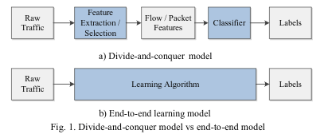
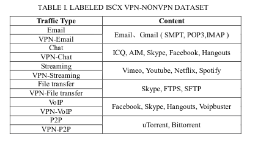
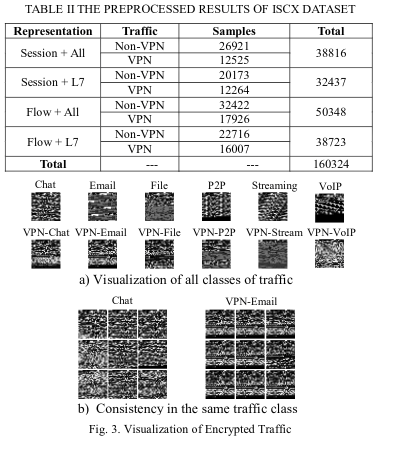
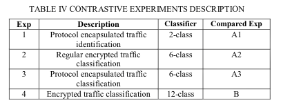
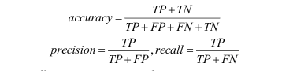
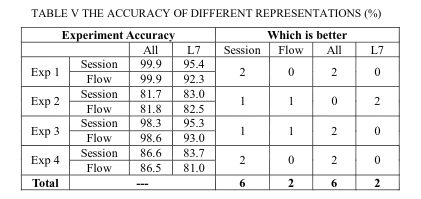
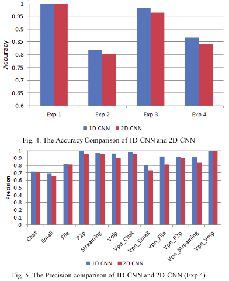
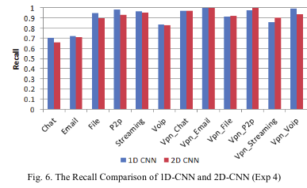
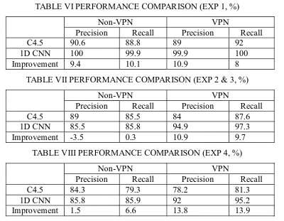

# 一维卷积神经网络的端到端加密流量分类

## 摘要

流量分类在网络管理和网络空间安全中起着重要的基础作用。 随着加密技术在网络应用中的广泛
使用，加密流量最近成为传统流量分类方法的巨大挑战。 在本文中，我们提出了一种具有一维卷
积神经网络的端到端加密流量分类方法。 该方法将特征提取，特征选择和分类器集成到统一的端
到端框架中，旨在自动学习原始输入和预期输出之间的非线性关系。 据我们所知，这是第一次将
端到端方法应用于加密流量分类域。 该方法使用公共ISCX VPN-nonVPN流量数据集进行验证。 
在所有四个实验中，具有最佳流量表示和微调模型，实验结果的12个评估指标中的11个优于最先
进的方法，这表明了所提出方法的有效性。

## 前言

流量分类是根据要求将网络流量与特定类别相关联的任务，这在网络管理和网络空间安全中是至关重要的任务。 例如，在网络管理领域，可以基于不同的优先级对流量进行分类，以保证网络的服务质量（QoS）。 在网络空间安全领域，流量可以分为良性流量或恶意软件流量，以实现网络异常检测的目标。 最近，随着加密技术在网络应用中的广泛使用，流量加密已成为当今的标准做法。 特别是，许多恶意软件使用诸如TLS之类的加密技术来加密通信流量以逃避防火墙和网络入侵检测系统的检测。 这些实践给传统的流量分类方法带来了新的挑战\[1\]。

根据ISO/OSI层的不同，流量加密技术可分为应用层加密，表示层加密和网络层加密\[2\]。 应用层加密意味着应用程序实现自己的协议以在应用层（例如BitTorrent或Skype）中进行安全数据传输，并且在一些论文中也称为常规加密。 表示层加密和网络层加密意味着应用程序加密来自上层的整个数据包，典型技术是TLS和IPsec，某些隧道技术（如VPN）基于这些技术。 此加密类型也称为协议封装。 在某些情况下，通过常规加密的加密流量可以通过协议封装（例如，通过VPN的Skype流量）进一步加密。 本文重点介绍常规加密流量分类和协议封装流量分类。

根据要求的粒度差异，加密流量分类可分为加密流量识别，加密流量表征和详细加密流量分类\[3\]。 加密流量识别意味着从未加密流量中识别加密流量，并且有许多关于此问题的研究。 详细的加密流量分类意味着将流量与特定应用程序相关联。 由于应用程序和版本的种类繁多，这项任务相对困难。 加密流量表征意味着将流量与一种应用程序（例如聊天或流媒体）相关联，并且最近对该任务进行了许多研究\[3\] \[4\]。 本文重点介绍加密流量表征。

有四种主要的流量分类方法\[5\]：基于端口，基于深度包检测（DPI），基于统计和基于行为。 由于随机端口和端口伪装的普遍使用，现在基于端口的方法的准确性非常低。 基于DPI的方法遇到很大困难，因为它无法解密加密的流量。 目前的研究主要集中在基于统计的方法和基于行为的方法。 基于\[6\]提出的流量分类分类法，它们都是机器学习方法，其一般工作流程如下：首先手工设计流量特征（例如流特征或分组特征），其次从原始提取和选择这些特征形成原始 流量，最后通过手工设计的分类器（例如决策树或朴素贝叶斯）对具有这些特征的流量进行分类。 工作流程逐步处理，每个步骤独立于其他步骤。 图1a显示了上述过程。 它本质上是一种分而治之的策略\[7\]，它将一个复杂的问题分解为几个子问题。 一方面，子问题变得更加简单和可控。另一方面，缺点也很明显。 子问题的最优解并不意味着全局问题的最优解，并且每个步骤的最优解并不意味着整个过程的最优解。

在本文中，我们提出了一种使用一维卷积神经网络\[1\]（1D-CNN）的加密流量分类的端到端方法。 该方法基于深度学习，这是表示学习领域中的代表性技术。 1D-CNN作为学习算法应用，直接从原始流量中自动学习特征。 流量特征是逐层学习的，高级特征是softmax层的输入。 最后，1D-CNN直接输出预测的标签。 图1b显示了上述过程。 该战略是端到端战略，通常用于深度学习技术。 它可以直接学习原始流量输入和预期输出标签之间的非线性关系，而不是将复杂问题划分为子问题。 与分而治之策略相比，端到端战略具有自然的协同效应\[9\]，更有可能获得全球最优解决方案。

我们的工作贡献如下。 首先，我们提出了一种使用1D-CNN的端到端加密流量分类方法，据我们所知，这是第一次将端到端方法应用于加密流量分类域。 其次，我们通过对比各种实验来确定加密流量的最佳表示类型和最佳1D-CNN模型架构。 最后，我们的研究对公共ISCX VPN-nonVPN（ISCX）流量数据集\[10\]的最新方法进行了重大改进。 此外，所有相关的研究数据，如我们的培训代码，培训数据，微调模型和详细的实验结果，将发布在GitHub（https://github.com/echowei/cnn-traffic）上，供任何感兴趣的研究人员使用

本文的其余部分安排如下。 第二节描述了相关工作。 第III节描述了使用1D-CNN的方法。 第四节主要包括实验结果和分析。 第五节介绍了讨论和未来的工作。 第六节提供结论性意见。

## 相关工作

目前对加密流量分类的研究主要集中在机器学习方法上。 这些研究最常使用两种主要类型的特征\[2\]：流特征（例如，每个流的持续时间，每秒流字节数）和分组特征（例如，分组大小，前n个分组的分组间持续时间） 。 根据Velen等人的评论。 \[2\]关于2005 - 2015年期间加密流量分类的26篇论文，12篇论文使用流程特征，5篇论文使用数据包功能，7篇论文使用流程和数据包功能的组合，2篇论文使用其他功能。

现在有很多关于常规加密流量分类的研究。 例如，Wang等人。 \[11\]，Coull等。 \[12\]和Mauro等人。 \[13\]分别研究了P2P，iMessage和WebRTC。 它们分别应用了流动特征，数据包特征和流动特征。 相应的分类器分别是C4.5决策树，朴素贝叶斯和随机森林。 相对而言，对协议封装流量分类的研究较少。 例如，Aghaei等人。 \[14\]提出了一种具有流特征的分类方法和代理流量的C4.5决策树分类器。Draper-Gil等人。 \[3\]提出了一种分类方法，在常规加密流量和协议封装流量上只有时间相关的流特征。 值得注意的是，他们发布了一个有价值的数据集，包括这两种类型的流量。

上面提到的论文都采用了传统的分治策略，现在使用端到端策略进行流量分析的论文数量非常少。 Wang \[15\]提出了一种基于堆叠自动编码器（SAE）的网络协议识别方法。 我们的团队提出了一种使用2D-CNN的恶意软件流量分类方法\[6\]。 这两篇论文都使用原始流量作为输入，最终标签作为输出。 从这个角度来看，它们是端到端的方法。 高等人。 \[16\]和Javaid等人。 \[17\]应用深度置信网络（DBN）和稀疏自动编码器（SAE）分别研究网络流量分类。 虽然这两种技术是深度学习技术，但他们使用手工设计的功能而不是原始流量作为输入。 也就是说，他们的方法不是端到端的方法。

## 方法

### 数据集

许多关于加密流量分类的研究使用了自我收集的流量或安全公司的私人流量，损害了其结果的可信度。 根据Velen等人的评论。 \[2\]在2005年至2015年期间关于加密流量分类的26篇论文中，只有6篇论文使用了公共数据集。 因为经典的机器学习方法需要手工设计的特征作为输入，所以许多当前的公共流量数据集是除了原始流量数据集之外的特征数据集，例如， 在上述评论中6篇论文使用的数据集。 Draper-Gil等人。 \[3\]发布了ISCX数据集，其中包括7种常规加密流量和7种协议封装流量。这些应用程序是当今最流行的，类型也非常多样化。 此流量数据集中有两种数据格式，流功能和原始流量（即pcap格式）。 我们使用ISCX数据集作为我们的测试数据集。

ISCX数据集的流程功能有14类标签，但原始流量没有标签，因此我们根据纸张描述在数据集中标记了pcap文件。 某些文件（如“Facebook_video.pcap”）可以标记为“浏览器”或“流媒体”，与“浏览器”和“VPN浏览器”相关的所有文件都有此问题。 即使在与作者进行电子邮件通信后我们也无法解决这个问题，因此我们决定不对这些文件进行标记。 最后，标记的ISCX数据集有12个类，包括6类常规加密流量和6类协议封装流量。 表I显示了标记的ISCX数据集的详细内容。

### 端到端框架概述

图2显示了我们提出的端到端加密流量分类方法的概述，包括预处理阶段，培训阶段和测试阶段。 与使用分而治之的传统机器学习方法相比，该框架不包含这些独立模块，如特征提取，特征选择和分类器。 事实上，这些模块已集成到CNN模型中。 自动学习这些特征，并通过softmax层直接对流量进行分类，然后确定原始输入和预期输出之间的非线性关系，从而实现端到端学习的目标。

第 I 阶段（数据预处理）。 此阶段预处理ISCX数据集的原始流量，并为CNN模型的输入数据生成所需的格式。 预处理工具是我们团队在\[6\]中开发的USTC-TL2016，包括四个步骤：流量分割，流量清理，图像生成和IDX转换。 有关此工具的详细说明，请参阅我们的论文。 应该注意的是，生成的IDX3文件的内容是原始流量的字节数据，而不是流特征或分组特征，这与传统的分治方法不同。

第 II 阶段（训练阶段）。 该步骤使用IDX3流量数据和从阶段I生成的IDX1标签数据训练CNN模型。训练方法是小批量随机梯度下降（SGD）。 10倍交叉验证技术用于保证CNN模型的泛化能力。 结果超参数将用于测试阶段

第 III 阶段（测试阶段）。 该步骤预测从阶段I生成的IDX3流量数据的类别标签，其中在阶段II中训练微调的CNN模型，并最终得到分类结果。

有两个问题需要进一步研究和讨论。 第一个问题是流量的表示选择。 换句话说，将使用哪部分原始流量以及如何组织这些流量字节数据？ 第二个问题是CNN模型选择。 换句话说，什么样的CNN模型更有效？ 这两个问题将在C和D节讨论。

### 流量表示

#### 表示选择

首先，原始流量需要分成不连续的单元。最常见的两种流量表示选择是会话和流量\[18\]。 会话是基于5元组划分的业务单元，即源IP，源端口，目的IP，目的端口和传输级协议。 流与会话非常相似，不同之处在于它只包含一个方向的流量，即源和目标IP /端口不可互换。

其次，每个分组中的业务字节数据可以分成多个协议层。 我们的工作中有两种类型的层选择。 第一种选择是ISO / OSI模型中的第7层或TCP / IP模型中的第4层（L7）。 直观地说，流量的特征应该反映在这一层。 例如，STMP协议表示电子邮件流量，HTTP协议表示浏览器流量。 它们都是应用层的协议基于这个假设; 王\[15\]只选择L7。 第二种选择是所有协议层（ALL）。 有时，L7下的流量数据还包含加密的流量特征信息。 例如，TL​​S的初始安全握手也在L7下。

总之，我们研究了四种流量表示选择，包括Session + L7，Session + All，Flow + L7和Flow + All。 应当注意，不同的流或会话可以具有不同的大小，但是CNN的输入数据大小必须是均匀的，因此仅使用每个流或会话的前n个字节（在本文中n = 784）。

#### 预处理结果

我们预处理ISCX数据集并获得四组结果。 表II显示了这些结果。 可以使用可视化技术分析预处理结果。 Session + All的可视化结果如图3所示，大小为784字节。 显然，不同类别的流量具有明显的识别度，每类流量具有高度一致性。 假设我们的方法可以实现良好的性能是合理的。

### CNN 模型

#### 为什么使用一维CNN

到目前为止，CNN主要应用于计算机视觉领域，例如图像分类。 最近，在自然语言过程（NLP）领域有一些成功的应用\[19\]。 事实上，根据LeCun的研究\[20\]，CNN适用于以下类型的数据：多个数组形式的数据; 具有强烈局部相关性的数据; 可以在任何地方出现的数据; 对象对翻译和扭曲不变的数据。 具体来说，1D-CNN适用于顺序数据或语言等数据。 2D-CNN适用于图像或音频谱图等数据。 3D-CNN适用于视频或体积图像等数据。

最近，有一些关于在网络流量分析中应用CNN的研究，如我们团队的恶意软件分类\[6\]。 它将流量转换为二维图像，如图3所示，然后应用2D-CNN对流量图像进行分类，实现流量分类的目标。 Wang \[15\]的方法非常相似，唯一的区别是它们使用了除2D-CNN之外的堆叠自动编码器（SAE）。

就我们而言，网络流量本质上是顺序数据。 它是由分层结构组织的一维字节流。 字节，数据包，会话和整个流量的结构非常类似于NLP域中的字符，单词，句子和整篇文章。 近年来，CNN在NLP中的成功应用都使用了1D-CNN，例如，情感分析和文本分类\[21\] \[22\]。 在本文中，我们受到这些研究的启发，用1D-CNN执行加密流量分类任务，并将其性能与2D-CNN进行比较。

#### 模型选择

用于比较的2D-CNN模型的架构与我们之前的工作\[6\]中使用的架构相同。 有关详细说明，请参阅该文件。

#### 对比实验

我们将ISCX数据集上的实验结果与\[3\]中现有技术方法的结果进行了比较，以验证我们提出的方法的性能。 有四个实验，他们都在\[3\]中进行了对比实验。 表IV描述了那些实验。

TensorFlow \[25\]用作在Ubuntu 14.04 64位操作系统上运行的软件框架。 服务器是DELL R720，内存为16GB。 Nvidia Tesla K40m GPU用作加速器。 随机选择1/10的数据作为测试数据，其余为训练数据。 小批量大小为50，损失函数为交叉熵。 TensorFlow内置的梯度下降优化器用作优化器。 学习率为1.0e-4，训练时间约为40个周期。

## 评估

### 评估指标

使用三个评估指标：准确性，精确度，召回率。 准确度用于评估分类器的整体性能。 精确度和召回率用于评估每类流量的性能。 TP是正确分类为X的实例数，TN是正确分类为Not-X的实例数，FP是错误分类为X的实例数，FN是错误分类为Not-X的实例数。

### 流量表示评估

表V显示了使用1D-CNN的不同类型的流量表示的实验结果。

基于会话与基于流量。 我们可以从上表中看到，有6个比较表明会话优于流量，准确率平均高出1.45％。 只有2次比较表明流量优于会话，精度仅高0.2％。 我们可以得出结论，会话更适合作为加密流量分类的流量表示类型。 可以给出直观的解释。 这是因为会话包含双向流并包含比单向流更多的交互信息，端到端方法可以从会话中学习比流更多的功能。

所有图层与L7相比。 上表还显示，有6个比较表明所有层都优于L7，平均精度高4.85％。 只有2次比较表明L7优于所有层，平均精度仅高1.0％。 我们可以得出结论，所有层的类型更适合作为加密流量分类的流量表示。 可以给出该结论的直观解释。 所有层的类型包含应用层下的所有数据，并保留更多加密协商阶段的信息。 例如，在传输层上执行密码TLS套件的协商。 端到端方法可以从所有层学习更多代表性特征。

总之，最佳类型的流量表示是会话+所有层，这个结论与我们之前的\[6\]发现一致。 当我们执行CNN模型评估时，将仅采用这种类型的流量表示。

### CNN模型评估

图4显示了1D-CNN和2D-CNN的准确性的比较。 图5和图6显示了Exp 4中12类加密流量的精确比较和召回比较。前三个实验显示了类似的模式。

如图4所示，两个CNN模型的准确度高于80％。 1D-CNN的准确度高于2D-CNN，高达2.51％。 如图5所示，在Exp 4中的所有12类加密流量中，11类1D-CNN的精度高于2D-CNN，平均高出3.75％。 如图6所示，在Exp 4中所有12类加密流量中，8类1D-CNN的召回率高于2D-CNN，平均值高出2.96％。 此外，有两类他们的召回大致相等。

总之，在加密流量分类任务中，1D-CNN比2D-CNN具有更好的性能。 它证明了我们的假设，即1D-CNN更适合于一维流量数据。 相比之下，当执行一维加密流量分类时，2D-CNN学习二维空间特征的优势并不明显，因此其性能相对低于1D-CNN。

### 与现有技术的性能比较

表VI，VII和VIII显示了我们提出的方法与\[3\]中最先进方法之间ISCX数据集的性能比较。 他们的论文仅显示了精确度和召回结果，因此我们仅使用这两个评估指标来比较性能。 表VII和VIII的精确度和召回率是平均值。 有关详细的实验结果，请参阅我们的共享Github文件。

1D-CNN在Exp 1中实现了出色的性能。非VPN和VPN流量的精度分别比最先进的方法高9.4％和10.9％。 与最先进的方法相比，非VPN和VPN流量的召回率分别高出10.1％和8％。 1D-CNN还在Exp 2,3和4中实现了VPN流量的出色性能。结果表明，该方法的精度比传统方法提高了10.9%，比传最先进的方法提高了13.8%，召回率比最先进的方法高9.7％和13.9％。 1D-CNN在Exp 4中的非VPN流量上实现了良好的性能。精度和召回率分别比最先进的方法高1.5％和6.6％。

1D-CNN在Exp 2和3中的非VPN流量上的性能不是很好。 虽然精度提高了0.3％，但召回率比最先进的方法低3.5％。 这表明非VPN流量和VPN流量之间存在很大的性能差异。 在分析了这两种流量的图像后，我们发现VPN流量的识别度似乎优于非VPN流量。 详细原因将在未来的工作中进行调查。

总之，所有四个实验都比最先进的方法获得了更大的改进。 它证实了我们提出的1D-CNN端到端加密流量分类方法的有效性。

## 讨论

我们提出的端到端加密流量分类方法可以省去传统的分治方法中常用的特征设计，特征提取和特征选择等传统步骤。 它使用1D-CNN自动学习加密流量的更多代表性功能。 实验结果比最先进的方法获得更好的性能。 未来的工作有三个问题需要进一步研究。 首先，关于流量表示，我们使用每个会话的前748个字节作为原始流量。 由于不同类别的流量具有不同类型的数据包，因此需要进一步研究更合适的字节数。 其次，关于模型训练，目前的训练数据不平衡，对实验表现有很大影响。 例如，VPN-VoIP流量有6000个训练样本，VPN-Email只有298个训练样本，其精度分别为99.5％和80％。 我们计划研究如何在训练数据不平衡时提高1D-CNN性能。 第三，实验结果表明，非VPN流量的性能相对较差。 我们计划分析细节原因并做出相应的改进。

## 结论

在分析机器学习领域采用分治策略的传统加密流量分类方法的基础上，提出了一种新的1D-CNN端到端加密流量分类方法。 该方法将特征设计，特征提取和特征选择集成到单个框架中，并且可以自动学习更具代表性的流量特征。 与分而治之策略相比，端到端战略具有自然的协同效应，更有可能获得全局最优解决方案。 最佳类型的流量代表是通过实验确定的。 我们发现1D-CNN比2D-CNN更适合加密流量分类任务，因为网络流量本质上是一维顺序数据，可以充分利用1D-CNN的优势。 公共ISCX数据集的实验结果对最先进的方法产生了重大改进，验证了我们提出的端到端方法的有效性。 这项工作和我们以前的工作\[6\]都证明了像CNN这样的深度学习技术在流量分类领域显示出了很好的潜力。 我们将继续朝这个方向进行深入研究。

## 引用

\[1\]Z. Cao, G. Xiong, Y. Zhao, Z. Li and L. Guo, "A survey on encrypted traffic classification" in Applications and Techniques in Information Security, Springer, pp. 73-81, 2014.  

\[2\]P. Velan, M. Cermak, P. Celeda and M. Drasar, "A survey of methods for encrypted traffic classification and analysis", International Journal of Network Management, vol. 25, no. 5, pp. 355-374, 2015. 

\[3\]G. Draper-Gil, A. H. Lashkari, M. S. I. Mamun and A. A. Ghorbani, "Characterization  of  encrypted  and  VPN  traffic  using  time-related features",  In  Proceedings  of  the  2nd  International  Conference  on Information  Systems  Security  and  Privacy(ICISSP),  pp.  407-414, 2016. 

\[4\]X.  Che,  B.  Ip  and  L.  Lin,  "A  Survey  of  Current  YouTube  Video Characteristics," in IEEE MultiMedia, vol. 22, no. 2, pp. 56-63, Apr.-June 2015. 

\[5\]E. Biersack, C. Callegari and M. Matijasevic, Data traffic monitoring and analysis. Berlin: Springer, 2013. 

\[6\]W. Wang, X. Zeng, X. Ye, Y. Sheng and M. Zhu, "Malware Traffic Classification   Using   Convolutional   Neural   Networks   for Representation  Learning"  In  the  31st  International  Conference  on Information Networking (ICOIN), Accepted, 2017. 

\[7\]T. H. Cormen, C. E. Leiserson, R. L. Rivest and C. Stein, Introductions to Algorithms, London, pp. 65-113, 2009. 

\[8\]Y.  LeCun,  L.  Bottou,  Y.  Bengio,  P.  Haffner,  "Gradient-Based Learning Applied to Document Recognition", Proc. IEEE, vol. 86, no. 11, pp. 2278-2324, Nov. 1998. 

\[9\]G. E. Dahl T. N. Sainath and G. E. Hinton "Improving Deep Neural Networks for LVCSR Using Rectified Linear Units and Dropout " in Proc. ICASSP, 2013. 

\[10\]ISCX   VPN-nonVPN   encrypted   network   traffic   dataset. http://www.unb.ca/cic/research/datasets/vpn.html, 2017 

\[11\]D. Wang, L. Zhang, Z. Yuan, Y. Xue and Y. Dong, "Characterizingapplication  behaviors  for  classifying  p2p  traffic",  Computing Networking  and  Communications  (ICNC)  2014  International Conference on. IEEE, pp. 21-25, 2014. 

\[12\]S. E. Coull and K. P. Dyer, "Traffic analysis of encrypted messaging services: Apple iMessage and beyond", ACM SIGCOMM Comput. Commun. Rev., pp. 5-11, 2014.  

\[13\]M. D. Mauro and M. Longo, "Revealing encrypted WebRTC traffic via  machine  learning  tools",  SECRYPT  2015  -  Proceedings  of  the 12th  International  Conference  on  Security  and  Cryptography,  pp.259-266, 20–22 July, 2015. 

\[14\]V. Aghaei-Foroushani and A. Zincir-Heywood, “A proxy identifierbased on patterns in traffic flows,” in HASE, Jan 2015. 

\[15\]Z. Wang, "The Applications of Deep Learning on Traffic Identification." https://goo.gl/WouIM6. 2015 

\[16\]N Gao, L Gao, Q Gao, "An Intrusion Detection Model Based on Deep Belief  Networks",  Advanced  Cloud  and  Big  Data  (CBD)  2014 Second International Conference on, pp. 247-252, 2014. 

\[17\]A. Javaid, Q. Niyaz, W. Sun and M. Alam. "A Deep Learning Approach for Network Intrusion Detection System." in Proc.9th EAI International   Conference   on   Bio-inspired   Information   and Communications Technologies. New York, 2016. 

\[18\]A. Dainotti, A. Pescape and K. Claffy, "Issues and future directions in traffic classification", Network IEEE, vol. 26, no. 1, pp. 35-40, 2012. 

\[19\]J. Gu, Z. Wang, J. Kuen, L. Ma, A. Shahroudy and B. Shuai, "Recent Advances  in  Convolutional  Neural  Networks",  arXiv  preprint arXiv:1512.07108, 2017. 

\[20\]Y. LeCun, Y. Bengio and G. Hinton, "Deep learning", Nature, vol. 521, pp. 436-444, May 2015. 

\[21\]Y.   Kim,   "Convolutional   Neural   Networks   for   Sentence Classification",   Proc.  Empirical   Methods   Natural   Language Processing, pp. 1746-1751, 2014. 

\[22\]X. Zhang and Y. LeCun, "Text understanding from scratch", arXivpreprint arXiv:1502.01710, 2016. 

\[23\]V. Nair and G.E. Hinton, "Rectified Linear Units Improve Restricted Boltzmann Machines", Proc. Int'l Conf. Machine Learning, 2010. 

\[24\]R. Collobert, J. Weston, L. Bottou, M. Karlen, K. Kavukcuoglu and P. Kuksa,  "Natural  Language  Processing  (almost)  from  Scratch", J.Machine Learning Research, vol. 12, pp. 2493-2537, 2011. 

\[25\]M. Abadi, A. Agarwal, P. Barham, E. Brevdo, Z. Chen, C. Citro, et al., "Tensor-Flow: Large-Scale Machine Learning on Heterogeneous Distributed Systems", arXiv preprint arXiv:1603.04467, 2016. 

**